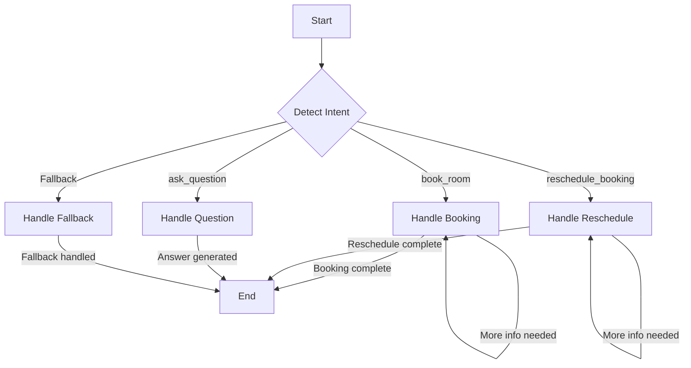

# AI Agent for Hotel Bookings (LangGraph & Instagram)

This project implements a sophisticated, stateful AI agent capable of handling hotel room bookings, rescheduling, and answering questions via Instagram Direct Messages. It is built using LangGraph for state management, LangChain for LLM integration, Google Gemini as the core language model, and FastAPI to handle webhooks from the Instagram Graph API.

## Architecture Overview

The agent is designed with a modular and scalable architecture to separate concerns and ensure maintainability.

-   **FastAPI Web Server (`src/api/main.py`)**: Serves as the main entry point. It exposes a `/webhook` endpoint to receive and verify incoming messages from the Instagram Graph API.
-   **Instagram Client (`src/instagram/client.py`)**: A dedicated client to handle all outbound communication with the Instagram Graph API, responsible for sending messages back to the user.
-   **LangGraph State Machine (`src/agent/graph.py`)**: The core of the agent's logic. It defines a conversational graph with nodes representing different states (e.g., detecting intent, handling a booking, answering a question) and edges representing the transitions between them. This stateful approach allows the agent to maintain context over long conversations.
-   **LLM Integration (`src/agent/agent.py`)**: Leverages LangChain and the Google Gemini Flash model for natural language understanding and generation. It's used for:
    -   **Intent Detection**: Classifying user messages into categories like `book_room`, `reschedule_booking`, or `ask_question`.
    -   **Response Generation**: Crafting context-aware and helpful replies for the user.
-   **Database Layer (`src/database/`)**: Uses SQLite with SQLAlchemy for data persistence. It stores all conversation messages and booking details, ensuring that the agent has a complete history of interactions.

## LangGraph Flow Diagram

The conversational flow is managed as a state graph, allowing for complex, multi-turn interactions while keeping the logic clean and easy to follow.


*   **Detect Intent**: The entry point for every user message. The LLM classifies the user's goal.
*   **Handle Booking**: A stateful node that guides the user through the booking process, collecting check-in/out dates, room type, and guest count.
*   **Handle Reschedule**: A node to manage modifications to existing bookings.
*   **Handle Question**: A node to answer general queries about the hotel.
*   **Handle Fallback**: Catches any intents that don't fit the main categories.

## Design Choices Justification

-   **LangGraph**: I chose LangGraph because it provides a powerful and explicit way to manage the state of a conversation. For a task like hotel booking, which involves multiple steps and context-switching, a state machine is far more robust than a simple request-response chain. It allows for cycles, interruptions, and a clear, observable flow.
-   **FastAPI**: Its high performance and asynchronous support make it ideal for handling real-time webhook events from Instagram without blocking. Its simple syntax and automatic documentation generation are also significant advantages.
-   **SQLite**: For a challenge of this scope, SQLite is the perfect choice. It's a lightweight, serverless, file-based database that requires no extra setup, making the project easy to run and test locally while still providing robust SQL-based data storage for conversations and bookings.
-   **Gemini Flash**: This model provides an excellent balance of speed, intelligence, and cost-effectiveness. For a real-time conversational agent, low latency is critical, and Gemini Flash delivers high-quality responses quickly, making for a smooth user experience.
-   **Modular Architecture**: The codebase is intentionally structured into distinct modules (`api`, `agent`, `database`, `instagram`). This separation of concerns makes the project easier to understand, debug, and extend in the future.

## Setup and Installation

Follow these steps to set up and run the project locally.

### 1. Prerequisites
- Python 3.10+
- `pip` and `venv` for package management
- An `ngrok` account to expose the local server to the internet.

### 2. Clone the Repository
```bash
# Clone your forked repository
git clone <your-repo-url>
cd <repo-name>
```

### 3. Set Up Virtual Environment
```bash
# Create a virtual environment
python -m venv venv

# Activate it
source venv/bin/activate
```

### 4. Install Dependencies
```bash
pip install -r requirements.txt
```

### 5. Configure Environment Variables
Create a `.env` file in the root of the project (`hotel_booking_agent/.env`) and add the following variables.

```env
# Get this from Google AI Studio or GCP
GOOGLE_API_KEY="YOUR_GOOGLE_API_KEY"

# Generate these from the Facebook Developer Portal
INSTAGRAM_ACCESS_TOKEN="YOUR_INSTAGRAM_PAGE_ACCESS_TOKEN"
INSTAGRAM_VERIFY_TOKEN="CREATE_A_SECRET_VERIFY_TOKEN" # e.g., "hotel_bot_secret_123"
```

### 6. Initialize the Database
Run the database initialization script to create the necessary SQLite tables.
```bash
PYTHONPATH=. python -c "from src.database.operations import init_db; init_db()"
```

### 7. Run the Local Server
Start the FastAPI server.
```bash
PYTHONPATH=. python -m uvicorn src.api.main:app --host 0.0.0.0 --port 8000
```

### 8. Expose Server with ngrok
In a new terminal window, start `ngrok` to create a public URL for your local server.
```bash
ngrok http 8000
```
Copy the `https://...ngrok-free.app` URL provided by `ngrok`.

### 9. Configure Instagram Webhook
1. Go to your **Facebook App Dashboard**.
2. Navigate to the **Webhooks** section for the **Instagram** product.
3. Set the **Callback URL** to your `ngrok` URL, appending `/webhook` (e.g., `https://your-ngrok-url.ngrok-free.app/webhook`).
4. Set the **Verify Token** to the same secret value you used in your `.env` file.
5. **Subscribe** to the `messages` field.
6. Verify and save the webhook subscription.

### 10. Start a Conversation!
Your AI agent is now ready. Send a Direct Message to the Instagram account connected to your Facebook App to begin a conversation.

## 🚀 Features

### Core Functionality
- ✅ **Hotel Room Booking**: Guided booking process with date, room type, and guest collection
- ✅ **Reschedule Bookings**: Modify existing reservation dates
- ✅ **Hotel Q&A**: Answer questions about amenities, check-in times, etc.
- ✅ **Conversation History**: Maintain context across multiple messages
- ✅ **Intent Detection**: Automatically detect user intent (booking, reschedule, question)
- ✅ **Error Handling**: Robust error handling with fallback responses

### Technical Features
- ✅ **Stateful Conversations**: LangGraph manages conversation state
- ✅ **Instagram Integration**: Real Instagram Graph API integration
- ✅ **Database Persistence**: SQLite for bookings and conversations
- ✅ **REST API**: FastAPI endpoints for testing and management
- ✅ **Logging**: Comprehensive logging for debugging
- ✅ **Environment Configuration**: Secure API key management

## 📋 Prerequisites

- Python 3.8+
- Google AI Studio account (for Gemini API key)
- Meta Developer account (for Instagram Graph API)
- Instagram Business account

## 🛠️ Installation & Setup

### 1. Clone the Repository
```bash
git clone <repository-url>
cd hotel_booking_agent
```

### 2. Create Virtual Environment
```bash
python -m venv venv
source venv/bin/activate  # On Windows: venv\Scripts\activate
```

### 3. Install Dependencies
```bash
pip install -r requirements.txt
```

### 4. Environment Configuration
Create a `.env` file in the project root:

```env
# Gemini API Key (from Google AI Studio)
GOOGLE_API_KEY=your_gemini_api_key_here

# Instagram Graph API
INSTAGRAM_ACCESS_TOKEN=your_instagram_access_token_here
INSTAGRAM_VERIFY_TOKEN=your_custom_verify_token_here

# Database
DATABASE_URL=sqlite:///hotel_bookings.db

# Logging
LOG_LEVEL=INFO
LOG_FILE=hotel_booking_agent.log

# Server
HOST=0.0.0.0
PORT=8000
```

### 5. Initialize Database
```bash
python -c "from src.database.operations import init_db; init_db()"
```

## 🔧 API Key Setup

### Gemini API Key
1. Go to [Google AI Studio](https://makersuite.google.com/app/apikey)
2. Create a new API key
3. Add it to your `.env` file as `GOOGLE_API_KEY`

### Instagram Graph API
1. Go to [Meta Developers](https://developers.facebook.com/)
2. Create a new app
3. Add Instagram Basic Display product
4. Generate access token
5. Add tokens to your `.env` file

## 🚀 Running the Application

### 1. Start the FastAPI Server
```bash
uvicorn src.api.main:app --reload --host 0.0.0.0 --port 8000
```

### 2. Test the System
```bash
python test_system.py
```

### 3. Test Individual Components
```bash
# Test Gemini API
python test_gemini.py

# Test booking agent
python -c "from src.agent.booking_agent import process_message; print(process_message('I want to book a room', 'test_user'))"
```

## 📡 Instagram Webhook Setup

### 1. Configure Webhook URL
In your Meta Developer dashboard, set the webhook URL to:
```
https://your-domain.com/webhook
```

### 2. Verify Webhook
The webhook verification endpoint is automatically handled at `/webhook`

### 3. Subscribe to Events
Subscribe to the following events:
- `messages`
- `messaging_postbacks`

## 🔍 API Endpoints

### Health Check
- `GET /` - Health check and service info

### Instagram Webhook
- `GET /webhook` - Webhook verification
- `POST /webhook` - Handle incoming messages

### Testing & Management
- `POST /send-message` - Send test message
- `GET /bookings/{user_id}` - Get user bookings
- `GET /conversations/{user_id}` - Get conversation history

## 🧪 Testing

### System Tests
```bash
python test_system.py
```

### Individual Tests
```bash
# Test booking flow
python -c "
from src.agent.booking_agent import process_message
print('1:', process_message('I want to book a room', 'user1'))
print('2:', process_message('2024-03-01 to 2024-03-05', 'user1'))
print('3:', process_message('suite', 'user1'))
print('4:', process_message('2 guests', 'user1'))
"

# Test reschedule flow
python -c "
from src.agent.booking_agent import process_message
print('1:', process_message('I want to reschedule', 'user2'))
print('2:', process_message('123', 'user2'))
print('3:', process_message('2024-03-10 to 2024-03-15', 'user2'))
"

# Test Q&A
python -c "
from src.agent.booking_agent import process_message
print(process_message('What time is check-in?', 'user3'))
"
```

## 🏗️ Design Choices & Justification

### 1. LangGraph for State Management
**Choice**: Used LangGraph's `StateGraph` for conversation flow
**Justification**: 
- Provides clear state transitions and conversation flow
- Handles complex multi-turn conversations
- Built-in support for conditional routing
- Easy to extend and modify conversation flows

### 2. Intent Detection Strategy
**Choice**: Keyword-based intent detection with fallback
**Justification**:
- Fast and reliable for common use cases
- No additional API calls required
- Easy to debug and maintain
- Can be enhanced with LLM-based classification later

### 3. Error Handling Approach
**Choice**: Multi-layer error handling with fallback responses
**Justification**:
- Ensures service availability even when LLM fails
- Provides user-friendly error messages
- Maintains conversation flow despite errors
- Comprehensive logging for debugging

### 4. Database Design
**Choice**: SQLite with SQLAlchemy ORM
**Justification**:
- Lightweight and suitable for development
- Easy to set up and maintain
- ACID compliance for data integrity
- Can be easily migrated to PostgreSQL for production

### 5. Instagram Integration
**Choice**: Direct Instagram Graph API integration
**Justification**:
- Real-time messaging capabilities
- Official API with good documentation
- Supports rich media and quick replies
- Reliable webhook system

## 📊 LangGraph Flow Diagram

See the complete flow diagram in [docs/flow_diagram.md](docs/flow_diagram.md)

The diagram shows:
- Intent detection and routing
- Booking flow with multiple steps
- Reschedule flow with validation
- Q&A flow with LLM integration
- Error handling and fallbacks

## 🔧 Configuration Options

### Environment Variables
- `GOOGLE_API_KEY`: Gemini API key
- `INSTAGRAM_ACCESS_TOKEN`: Instagram Graph API access token
- `INSTAGRAM_VERIFY_TOKEN`: Custom webhook verification token
- `DATABASE_URL`: Database connection string
- `LOG_LEVEL`: Logging level (INFO, DEBUG, ERROR)
- `HOST`: Server host address
- `PORT`: Server port number

### Hotel Configuration
- Room types: Standard ($100/night), Deluxe ($150/night), Suite ($250/night)
- Check-in time: 14:00
- Check-out time: 12:00
- Amenities: 24/7 room service, WiFi, pool, gym, restaurant, spa, business center

## 🐛 Troubleshooting

### Common Issues

1. **Gemini API Errors**
   - Check API key validity
   - Verify model name (should be `gemini-2.0-flash`)
   - Check rate limits

2. **Instagram Webhook Issues**
   - Verify webhook URL is accessible
   - Check verify token matches
   - Ensure proper SSL certificate

3. **Database Errors**
   - Run database initialization
   - Check file permissions
   - Verify database path


**Built with ❤️ using LangGraph, LangChain, and Gemini LLM** 


---

## Contact Details

- **Name:** Vishal Keshari
- **Email:** vishalkeshari2004@gmail.com
- **Phone:** 8173054118
