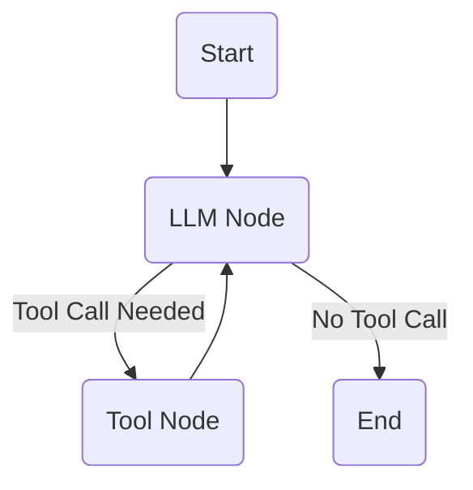

# Hotel Booking AI Agent

## Overview
This project implements a conversational AI agent for hotel bookings, rescheduling, and hotel-related Q&A using LangGraph, LangChain, and Groq LLM. The agent interacts with users via Instagram DMs, maintains conversation state, and stores booking data in a lightweight JSON database.

---

## Features
- **Book a hotel room:** Guides users through booking, collecting check-in/out dates, room type, and number of guests.
- **Reschedule a booking:** Allows users to modify existing reservation dates.
- **Answer hotel-related questions:** Responds to queries about amenities, check-in times, location, etc.
- **Maintain conversation history:** Uses LangGraph to provide context-aware, stateful conversations.
- **Instagram integration:** Receives and sends DMs via the Instagram Graph API.
- **Data management:** Stores reservations in a JSON file for simplicity.

---

## Setup Instructions

### 1. Clone the Repository
```
git clone <your-forked-repo-url>
cd <repo-directory>
```

### 2. Create and Activate a Virtual Environment (Recommended)
```
python -m venv venv
# On Windows:
venv\Scripts\activate
# On macOS/Linux:
source venv/bin/activate
```

### 3. Install Dependencies
```
pip install -r requirements.txt
```

### 4. Configure Environment Variables
- Copy `.env.example` to `.env` and fill in your credentials:
```
INSTAGRAM_API_TOKEN="your_instagram_api_token"
GROQ_API_KEY="your_groq_api_key"
FACEBOOK_PAGE_ID="your_facebook_page_id"
WEBHOOK_VERIFY_TOKEN="your_webhook_verify_token"
APP_SECRET="your_app_secret"
```

### 5. Run the FastAPI App
```
python -m app.main
```

### 6. Expose Localhost with ngrok
```
ngrok http 8000
```
- Copy the HTTPS URL for webhook setup.

### 7. Set Up Instagram Webhook
- In the Facebook Developer Portal, add your ngrok URL + `/webhook` as the callback URL.
- Use your `WEBHOOK_VERIFY_TOKEN`.
- Subscribe to `messages` and `messaging_postbacks` fields.

### 8. Link Instagram Account
- Convert your Instagram account to Professional.
- Link it to your Facebook Page.
- Add your Instagram username as a tester in the Facebook Developer Portal and accept the invite.

---

## Architecture & Design Choices
- **LangGraph State Machine:** Manages conversation flow, tool invocation, and stateful context.
- **Groq LLM:** Chosen for its free tier and fast, reliable responses.
- **FastAPI:** Provides a robust, async web server for webhook handling.
- **JSON Database:** Lightweight, easy to use for prototyping and small-scale deployments.
- **Instagram Graph API:** Enables real-time DM interaction with users.

---

## LangGraph Flow Diagram



---

## Known Issues / Limitations
- New Instagram accounts may take time to be recognized as testers by Meta.
- Only basic hotel data is mocked; no real hotel API integration.
- For production, consider using a persistent database and secure secret management.

---

## How to Test
- Send a DM to your linked Instagram account from another account.
- Watch your FastAPI and ngrok logs for incoming requests and responses.

---

## Contact
For questions or issues, please open an issue or contact the project maintainer. 