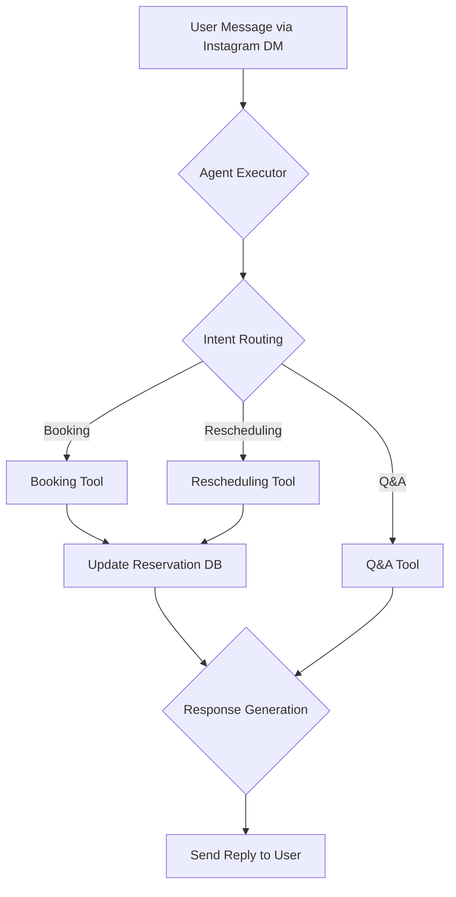

# AI Hotel Booking Agent

This project is an AI-powered agent that assists users with hotel room bookings, rescheduling, and answering hotel-related questions via Instagram DMs. It's built using LangGraph, LangChain, and Google's Gemini LLM to manage conversational flows and maintain context.

## Features

- **Room Booking:** Book a hotel room through a conversational interface.
- **Booking Rescheduling:** Modify existing reservations.
- **Hotel Q&A:** Answer general questions about the hotel (e.g., amenities, check-in/out times).
- **Context-Aware Conversations:** Remembers previous parts of the conversation to provide relevant responses.
- **Instagram Integration:** Interacts with users directly through Instagram DMs.

## Tech Stack

- **LLM Framework:** LangChain & LangGraph
- **LLM:** Google Gemini
- **Platform:** Instagram (via Instagram Graph API)
- **Database:** SQLite / JSON file

## Architecture & Flow

The agent uses LangGraph to define a stateful graph that manages the conversation. Each node in the graph represents a step in the process, such as identifying user intent, calling a tool for booking or Q&A, and generating a response.

Below is the LangGraph flow diagram:



## Setup and Installation

Follow these steps to set up and run the project locally.

### 1. Clone the Repository

```bash
git clone <repository-url>
cd <repository-directory>
```

### 2. Create a Virtual Environment and Install Dependencies

```bash
# Create a virtual environment
python -m venv venv

# Activate the virtual environment
# On macOS/Linux:
source venv/bin/activate
# On Windows:
# venv\Scripts\activate

# Install the required packages
pip install -r requirements.txt
```

### 3. Set Up Environment Variables

Create a `.env` file in the root of the project by copying the example file:

```bash
cp .env.example .env
```

Add your credentials to the `.env` file:

```
GEMINI_API_KEY="your_gemini_api_key"
INSTAGRAM_API_ACCESS_TOKEN="your_instagram_access_token"
DATABASE_URL="sqlite:///reservations.db"
```

### 4. Get API Keys

-   **Gemini API Key**: You can get your API key from [Google AI Studio](https://aistudio.google.com/app/apikey).
-   **Instagram Graph API Access Token**: To get an API key for the assignment, please send a DM to **[phone_number]**.

### 5. Initialize the Database

If you are using SQLite, run the following command to set up the database schema (assuming a `database.py` with an `init_db` function).

```bash
python -c "from database import init_db; init_db()"
```

### 6. Run the Application

```bash
python main.py
```

## Deliverables

-   **Source Code:** The complete source code is included in this repository.
-   **LangGraph Diagram:** The flow diagram is included in the [Architecture & Flow](#architecture--flow) section of this README.
-   **README:** This file serves as the setup and documentation guide. 
