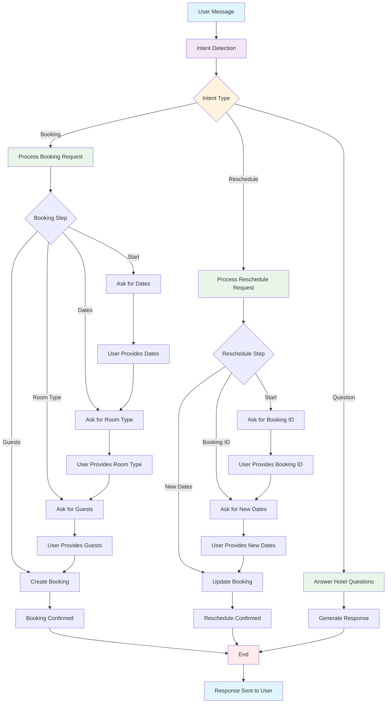

# Hotel Booking AI Agent - LangGraph Flow Diagram

## Overview
This diagram illustrates the conversational flow and state transitions of our hotel booking AI agent built with LangGraph.

## Flow Diagram

## State Machine Details

### Entry Point
- All conversations start with **Intent Detection**
- The agent analyzes the user's message to determine their intent

### Intent Types
1. **Booking**: User wants to book a new room
2. **Reschedule**: User wants to modify an existing booking
3. **Question**: User has general questions about the hotel

### Booking Flow
1. **Start**: Agent asks for check-in and check-out dates
2. **Dates**: Agent asks for room type (Standard, Deluxe, Suite)
3. **Room Type**: Agent asks for number of guests
4. **Guests**: Agent creates the booking and provides confirmation

### Reschedule Flow
1. **Start**: Agent asks for booking ID
2. **Booking ID**: Agent asks for new check-in and check-out dates
3. **New Dates**: Agent updates the booking and confirms

### Question Flow
1. **Question**: Agent uses Gemini LLM to generate contextual responses
2. **Fallback**: If LLM fails, agent uses predefined responses

### Error Handling
- Invalid dates: Agent asks for dates in correct format
- Invalid booking ID: Agent asks for valid booking ID
- LLM failure: Agent uses fallback responses
- API failures: Agent provides error messages

## Key Features

### State Management
- Uses LangGraph's `StateGraph` for conversation state management
- Maintains context across multiple messages
- Handles conversation history and user preferences

### Intent Detection
- Keyword-based intent classification
- Supports natural language variations
- Default fallback to booking intent

### Error Recovery
- Graceful handling of invalid inputs
- Fallback responses for LLM failures
- User-friendly error messages

### Integration Points
- Instagram Graph API for messaging
- SQLite database for data persistence
- Gemini LLM for intelligent responses 